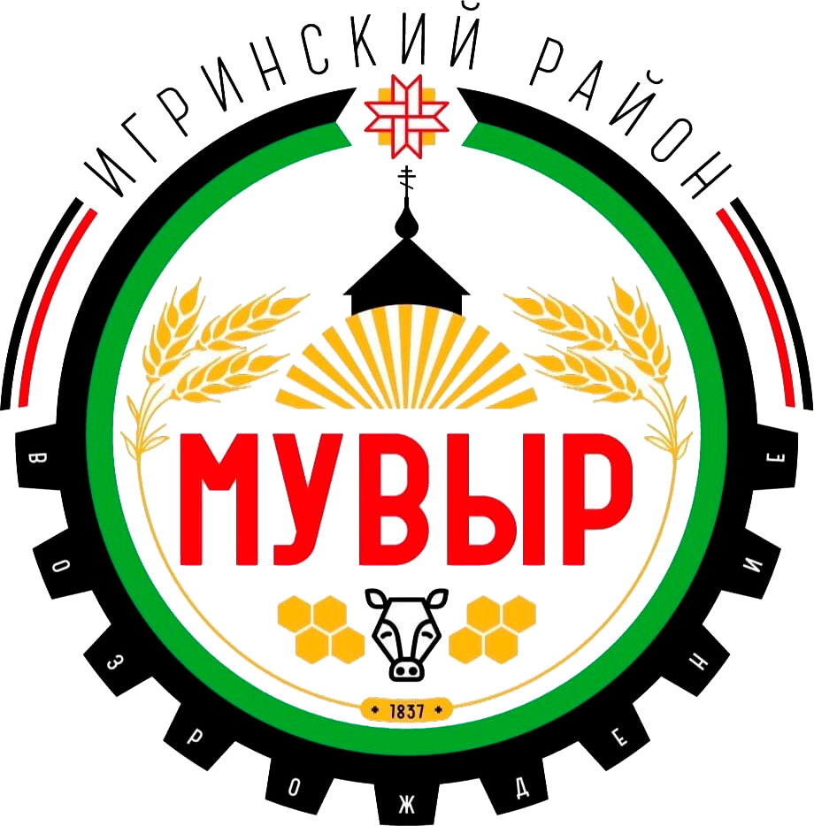
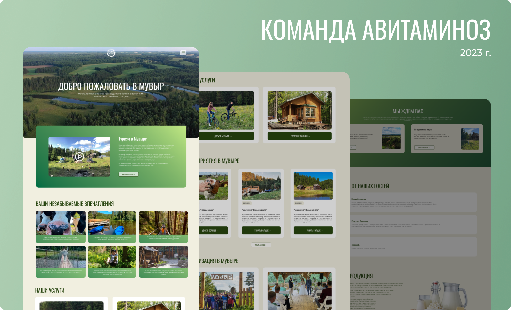

    

<h2 align="center">Хакатон "Открывай Удмуртию" – Основной тур</h2>

<i>Команда "Авитаминоз"</i>

    

  

📌<b>Задача:</b> В рамках хакатона необходимо разработать сайт для деревни Мувыр. На
главной странице сайта необходимо использовать фотографии деревни. Сайт
должен быть простым и доступным для пользователя. 

    

    Главная страница

    

<h3>📌Техническое задание:</h3>
<ul>
    <li>Ознакомление потенциальных туристов с основными услугами, ценами и видами отдыха в деревне Мувыр;</li>
    <li>Освещение мероприятий деревни;</li>
    <li>Возможность бронирования гостевых домиков и беседок в режиме реального времени. </li>
</ul>

<h3>📌Структура сайта:</h3>
<ol>
    <li>Что такое Мувыр?</li>
    <li>Организация экскурсий</li>
    <li>Аренда домиков и беседок</li>
    <li>Прокат</li>
    <li>Информация о продаваемой продукции "Мувыр"</li>
    <li>Прокат лодок, велосипедов, тюбингов</li>
    <li>Новости и анонс мероприятий</li>
    <li>Информация для инвесторов</li>
    <li>Контакты</li>
</ol># muvir
